# 膝关节康复角度波形分类系统模型架构与工作原理

## 1. 系统整体架构

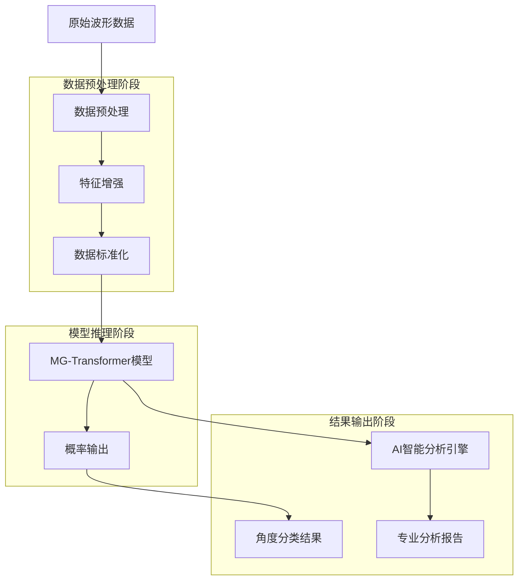

## 2. MG-Transformer 模型架构详解

```mermaid
graph LR
    A[输入波形序列<br/>[Batch, SeqLen, Features]] --> B[CNN特征提取层]
    B --> C[位置编码]
    C --> D[Transformer编码器]
    D --> E[多尺度池化]
    E --> F[全连接分类器]
    F --> G[角度分类概率]
    
    subgraph MG-Transformer模型
        B
        C
        D
        E
        F
    end
```

### 2.1 CNN特征提取层

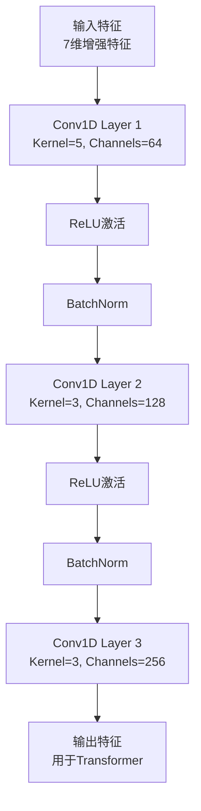

### 2.2 特征增强模块

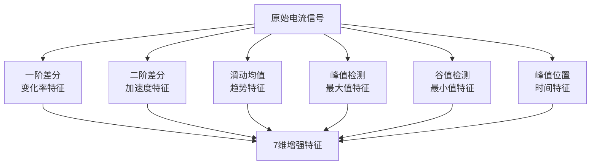

### 2.3 Transformer编码器

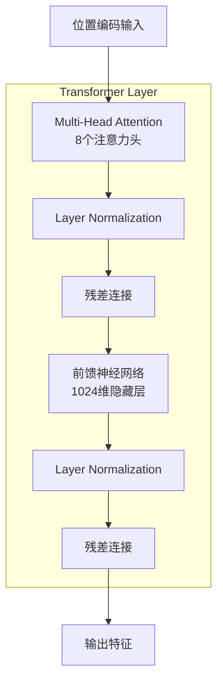

### 2.4 多尺度池化策略

```mermaid
graph TB
    A[Transformer输出<br/>[Batch, SeqLen, Features]] --> B[平均池化]
    A --> C[最大池化]
    A --> D[最小池化]
    B --> E[特征拼接]
    C --> E
    D --> E
    E --> F[全连接分类器输入]
```

## 3. 模型训练流程

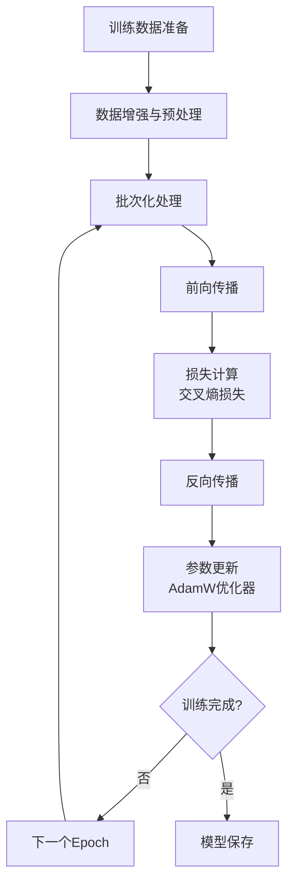

## 4. 损失函数与优化器

### 4.1 损失函数：交叉熵损失

$$\text{Loss} = -\sum_{i=1}^{N} y_i \log(\hat{y}_i)$$

其中：
- $N$ 是类别数量
- $y_i$ 是真实标签（one-hot编码）
- $\hat{y}_i$ 是预测概率

### 4.2 优化器：AdamW

$$\theta_{t+1} = \theta_t - \frac{\eta}{\sqrt{\hat{v}_t} + \epsilon} \hat{m}_t$$

其中：
- $\theta_t$ 是模型参数
- $\eta$ 是学习率
- $\hat{m}_t$ 和 $\hat{v}_t$ 分别是梯度的一阶矩和二阶矩估计

## 5. 注意力机制详解

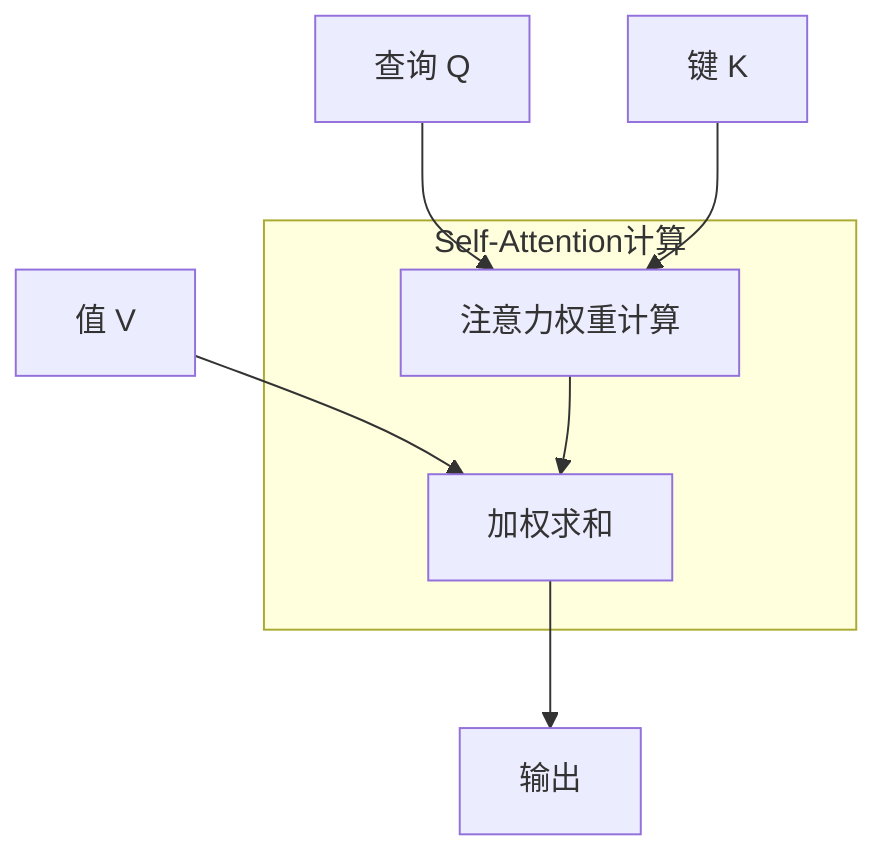

### 5.1 注意力权重计算公式

$$\text{Attention}(Q, K, V) = \text{softmax}\left(\frac{QK^T}{\sqrt{d_k}}\right)V$$

其中：
- $Q$ 是查询矩阵
- $K$ 是键矩阵
- $V$ 是值矩阵
- $d_k$ 是键向量的维度

### 5.2 多头注意力机制

$$\text{MultiHead}(Q, K, V) = \text{Concat}(\text{head}_1, ..., \text{head}_h)W^O$$

$$\text{head}_i = \text{Attention}(QW_i^Q, KW_i^K, VW_i^V)$$

## 6. 位置编码

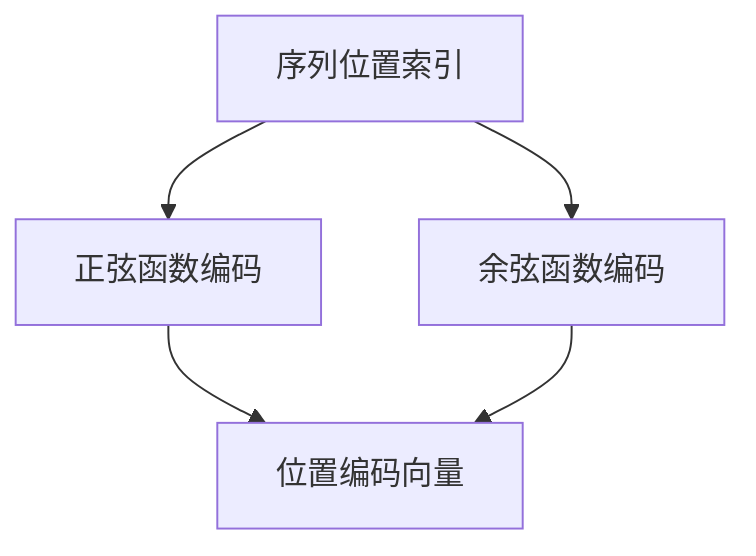

### 6.1 位置编码公式

$$PE_{(pos,2i)} = \sin\left(\frac{pos}{10000^{2i/d_{model}}}\right)$$

$$PE_{(pos,2i+1)} = \cos\left(\frac{pos}{10000^{2i/d_{model}}}\right)$$

其中：
- $pos$ 是位置
- $i$ 是维度
- $d_{model}$ 是模型维度

## 7. 产品功能逻辑图

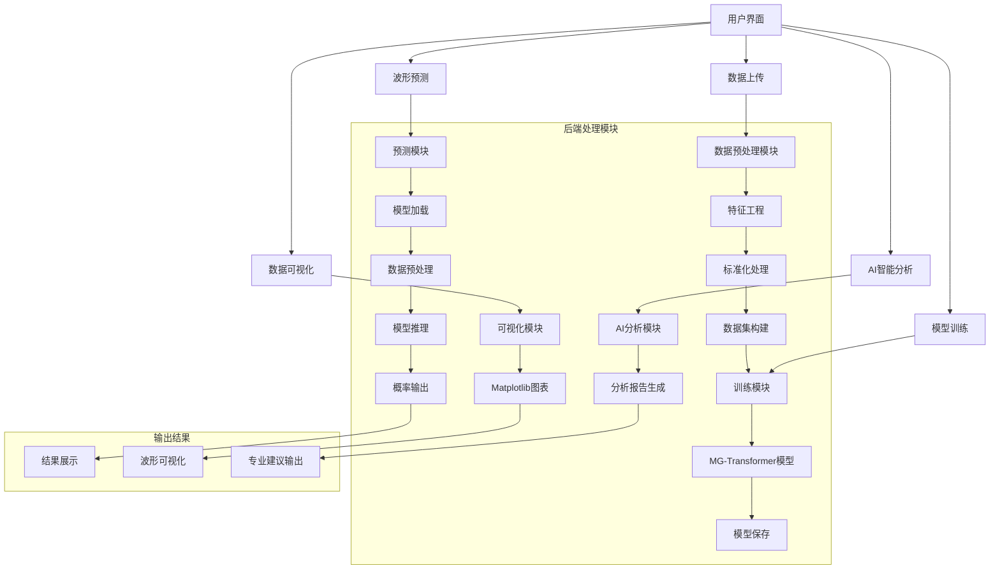

## 8. 科研级可视化示例

### 8.1 混淆矩阵示意图

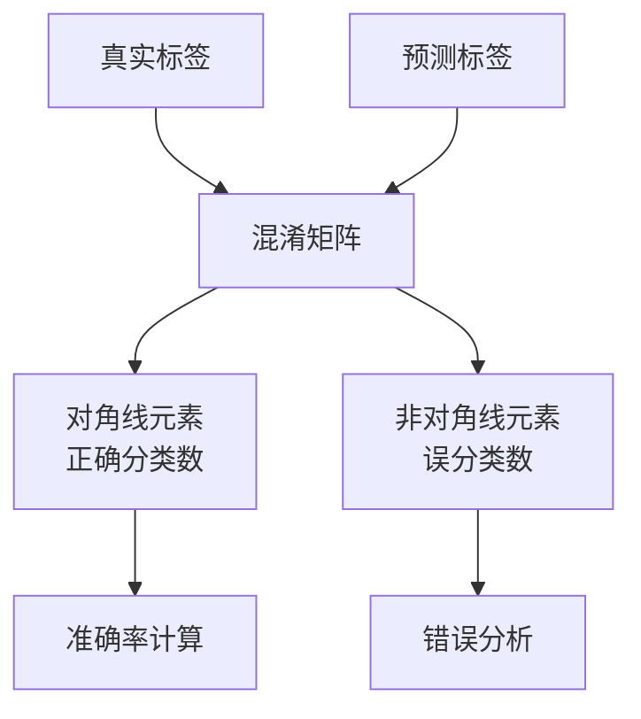

### 8.2 训练过程监控

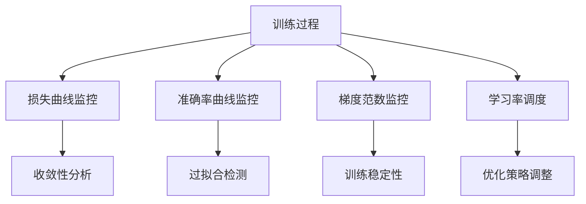

## 9. 性能优化策略

### 9.1 数据增强技术

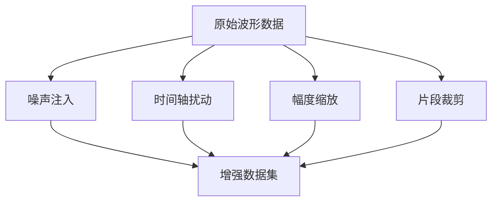

### 9.2 正则化技术

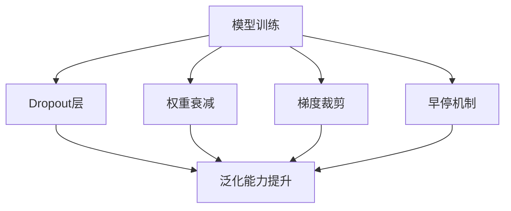

以上架构图展示了膝关节康复角度波形分类系统的完整技术架构和工作原理，从数据预处理到模型推理再到结果输出，涵盖了整个产品的工作流程。