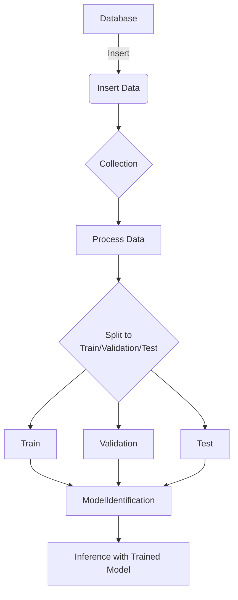

```mermaid
graph TD
    A[Database] -->|Insert| B(Insert Data)
    B --> C{Collection}
    C --> D[Process Data]
    D --> E{Split to<br>Train/Validation/Test}
    E --> F[Train]
    E --> G[Validation]
    E --> H[Test]
    F --> I[ModelIdentification]
    G --> I
    H --> I
    I --> J[Inference with Trained Model]
```